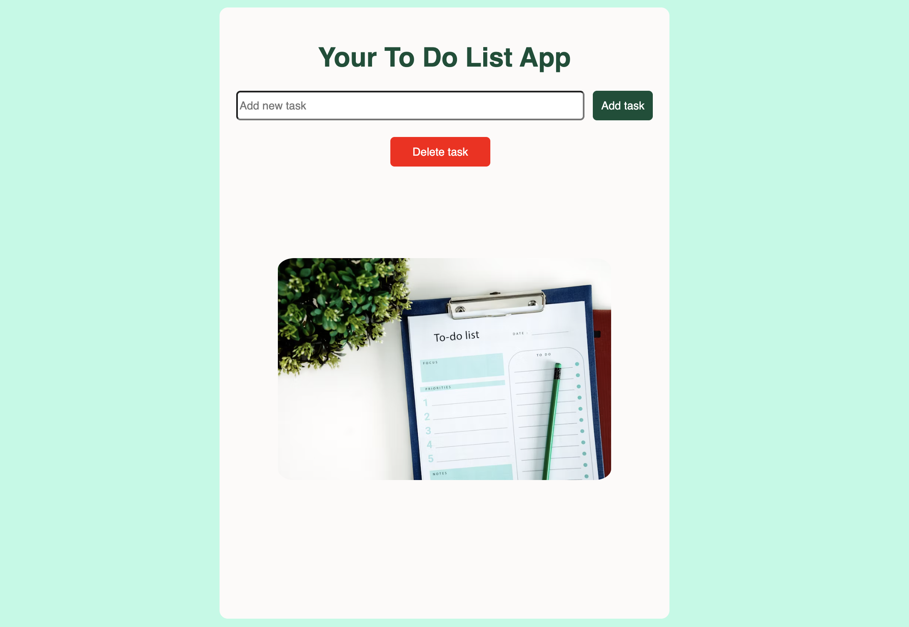

# 📝 ToDo React App

  <a href="https://rad-lolly-605977.netlify.app/" target="_blank">🌐 View Live Demo</a>

---

## 📌 Overview

**ToDo React App** is a simple and intuitive task management application.  
Users can **add**, **edit**, **mark as completed**, and **delete** tasks with ease.  
The clean UI helps to stay organized and productive every day.

The source code includes clear comments to help beginners learn React component structure and hooks.

---

## 🎯 Purpose

This project was built to practice **React**, **component state management (useState)**, and **JavaScript event handling**.  
It is part of my **Frontend Developer** portfolio and demonstrates the ability to create interactive single-page applications from scratch.

---

## 💡 What I Learned

- Building reusable React components  
- Managing state with `useState`  
- Passing data via props  
- Handling form input and events  
- Styling components with CSS  
- Deploying a React app to Netlify

---

## 🛠️ Built With

- ⚛️ [React](https://reactjs.org/)  
- 💛 [JavaScript (ES6+)](https://developer.mozilla.org/en-US/docs/Web/JavaScript)  
- 🎨 [CSS3](https://developer.mozilla.org/en-US/docs/Web/CSS)  
- 🚀 [Create React App](https://github.com/facebook/create-react-app)

---

## ✨ Features

- ✅ Add new tasks  
- ✅ Edit existing tasks  
- ✅ Delete tasks  
- ✅ Mark tasks as completed  
- ✅ Responsive design

---

## ⚙️ Installation & Setup

   1. **Clone the repository:**
      git clone https://github.com/NataliiaLitskevych/To-Do-List.git

      cd todo-react-app
   3. **Install dependencies:**
      npm install
   4. **Run the app:**
      npm start
   5. **Open the app in your browser:**
      👉 http://localhost:3000

---

## 🚀 Deployment

This project is deployed on **Netlify**.  
Live demo: [https://rad-lolly-605977.netlify.app/](https://rad-lolly-605977.netlify.app/)

## 🧠 Author

👩‍💻 **Nataliia Litskevych**  
📎 **Portfolio:** [https://myportfolio-nataliia-litskevych.netlify.app/](https://myportfolio-nataliia-litskevych.netlify.app/)  
🌐 **LinkedIn:** [https://linkedin.com/in/nataliia-litskevych](https://linkedin.com/in/nataliia-litskevych)  
💌 **Email:** nataliia.litskevych@gmail.com

